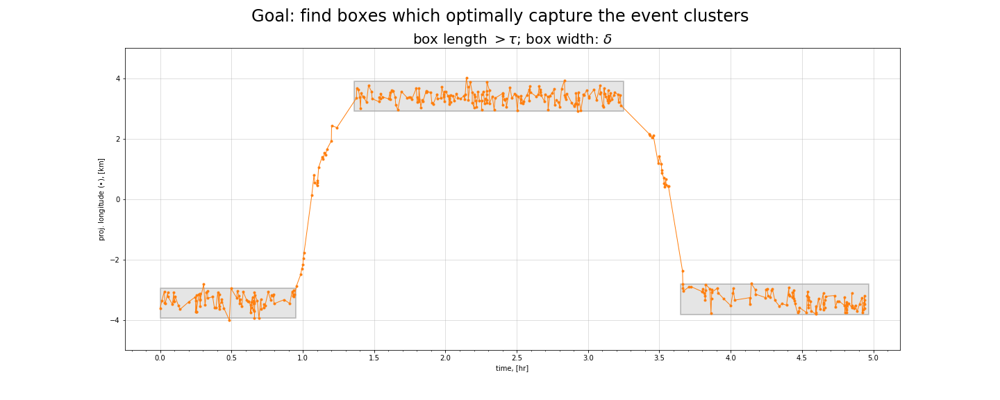
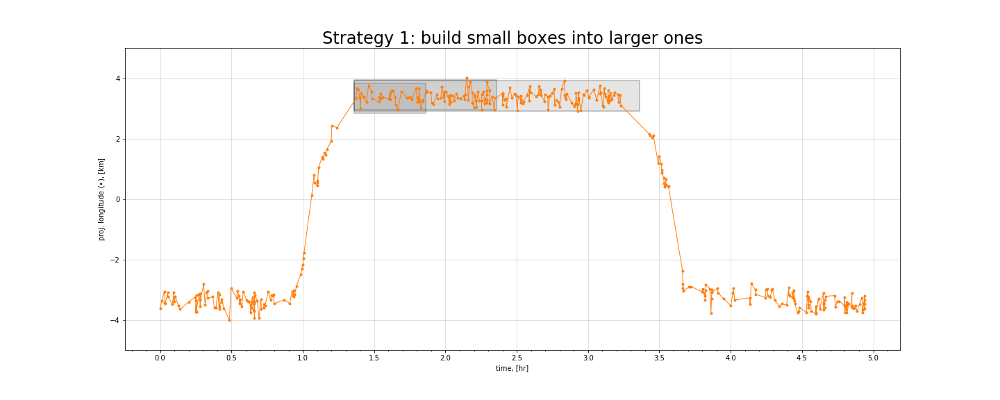
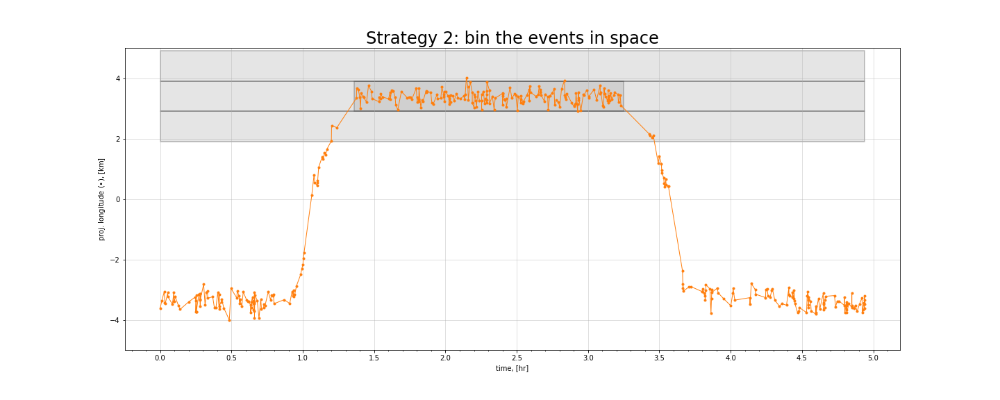
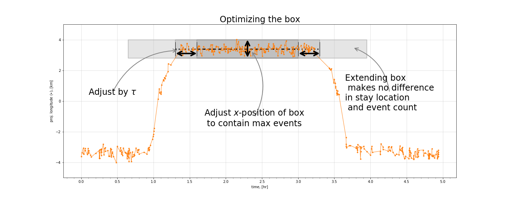

# The project

## The goals

The goal of this project is multifold:
1. have a method which, albeit potentially slow, optimally decomposes an event sequence into a sequence of stays and travels
    - _optimally_ means that given the uncertainty and statistical measures involved to determine the stay, there are no better classifications possible
2. once a method is established, find faster, more efficient approximations
3. have a reference to explore, compare and evaluate other methods:
    - regressors: _e.g._ piecewise linear regression, gaussian process regression 
    - cluster algorithms, _e.g._ DBSCAN 
    - Time-series analysis, such as break-point identifiers, _e.g._ Ruptures
    - CNNs and object detection: _e.g._ WaveNet, YOLOv3

## Contents

There are a few different modules included here:
- `synthetic_data`: a module which creates event sequences which are meant to simulate data coming from mobile device signaling events
    - sequences can be specified, with locations and endpoints of stays
    - sequences can be randomly specified
    - batches of sequences are also possible to test any new methods on many examples
    - canonical sequences, 
        - _ie_ minimal subsequences which exhibit the main challenges, 
        - useful for quick testing and fault identification
    - plotting tools for inspecting the sequences and the classifiers
- `stay_classification`: a module which includes
    - the base classifiers (submodules)
    - tools for refinement (submodules)
    - custom metrics for evaluation of the classifiers' performance  

--- 

# Introduction: movement analysis

From a sequence of signaling events, _eg_ GPS measurements, determine locations where the device remains stationary for a significant duration of time; these are commonly called "stays". 
For each of these, there should be a beginning and end, as well as a location (and buffer) which describes an area where the device is likely stationary . 

**Note** the signaling events for a given device, form a set $\mathcal{E} :=  \{e_i = (\mathbf{x}_i, t_i), i=[0,N-1] \; | \; t_{i+1}\geq t_i\}$, where $\mathbf{x}_i$ represents a pair of longitude, latitude--coordinates at time $t_i$.

## A sequence of spatio-temporal events

Such a sequence of events may look like this:

  
**Figure 1** 
  
There are a few noticeable clusters of events which are likely stays; and they're connected by two paths, which are commonly called "travels".
Note the colors denote arbirary subsequences and are associated with the plots below where the time is shown explicitly.
(For an interactive HTML map, click [here](file:///home/sandm/Notebooks/stay_classification/docs/illustration/map.html).)

## 2D1T rendering

The map-view of the event sequences tells a lot but it also obscures a lot. It's helpful to view the sequences rather in a format where time is explicitly visible.
Enter the 2D1T plot: two spatial dimensions and time.

  
**Figure 2** 
  
Here in the 2D1T view, time is on the "$x$"-axis. Note that it's not really a 2D1T plot, but rather two 1D1T plots with the longitude on the left $y$-axis and the latitude on the right $y$-axis. The trajectory can be more clearly seen as (at least) three stays and two travels: initially around lon. $\approx$13.25, then a stay at lon. $\approx$ 13.375, and returning to the initial location. 

### Apply projections, and Shift & Scale transforms

A few further transforms are helpful: namely rescaled and shifted coordinates in a local coordinate frame.

  
**Figure 3** 
  
To make the classification easier, the coordinates are projected into a local coordinate frame where the distance metric and statistics are homogeneous and isotropic, and are easier to apply. For further convenience, the projected coordinates and time are rescaled and shifted.

The goal now, is to automatically identify the stays: where they begin and end, as well as an estimate of their locations.

---

# Stay classification

The quasi-2D1T plots show clearly that identifying a stay effectively means to fit subsequences of event with flat (constant lon.- and lat.-) lines.

For a subsequence of events $\mathcal{s}_l =  \{e_i \; | \; i = [m,n]_l \subset [0,N-1]\}$, a "flat line" has $|\mathbf{x}_m-\mathbf{x}_n| = 0 $. However, since there's noise, a more general spefication is needed.

## Stay specifications

Stays have some universal requirements.

Firstly, there are the primary requirements:
1. identify the start/stop
2. estimate a dominant location, _ie_ the "central location" of the stay

Then, there are some secondary rquirements:
1. the clusters should contain a minimum number of points
2. the duration between the first and last points should exceed $\tau$
3. the clusters should be as long (in time) as _contiguously_ possible
    - no sufficiently long breaks between consecutive events

One additional requirement which affects all of the above: outliers should be identified and ignored
- outliers can change the central location and also the beginning/ending of the clusters

## The 'box' methods

### Description

**Note** this discussion is in 1D1T but it can also be applied to 2D1T.

There are a few strategies which are prusued here and they all use "boxes". The boxes (technically cylinders in 2D1T space) are parallel to the time direction and are longer than a minimal duration $\tau$ and have fixed widths $\delta$, which is the spatial resolution in oder to distinguish nearby stays. 

The boxes are to optimized to effectively contain as many events as possible by
- maximizing the length (_ie_ the duration) to contain the longest quasi-contiguous, unbroken subsequences 
    - 'unbroken' means there are no gaps longer than some specified lengths
- finding the central location of the box, _ie_ the centre line or axis
- **Note** these optimizations are not independent
    - _e.g._ shifting a box in $x$, and possibly losing events, can allow it to be longer, possibly gaining more events; and vice-versa.

  
**Figure 4** 
  
An illustration of the end-goal of a box method. One box is centered around one stay; each capturing most of the events. This can also be applied to 2D1T, where the box is a cylinder of radius $\delta/2$.

### Two strategies

Generically speaking, there are two main strategies: 
- build minimal boxes around short subsequences and grow the boxes. 
- start with optimally-placed, full-duration boxes and cut down as needed

#### Strategy 1: growing boxes

  
**Figure 5** 
  
A 'growing' box method illustrated on the middle stay. A short sub-sequence is identified, and a box is placed around it. The box is then iteratively extended and repositioned (within the threshold) to maximize duration, until no more events are added.

##### **Description**

##### The "wordy" version

1. initialize the box, _ie_ around a single event.
2. extend the box-ends forward and backwards in time by $\tau$, the minimum time for a stay
3. include new events within the new box
4. update box
5. repeat 1$-$3 until no changes are detected 

##### The "mathy" version
1. Initialize box: given an event $e_i$
    - initialize the central location $x_{\mathrm{cent.}} = x_i$
        - box width is  $x_{\mathrm{cent.}} \pm \delta$
    - initialize box-end timepoints as $t_m , t_n = t_i$ 
2. extend box-ends forward and backwards in time in increments of $\tau$
    - $\tau$, the minimum time for a stay
    - new box-ends: $t'_m = t_m - \tau$ and $t'_n = t_n + \tau$
3. include events, $\{e'(x',t')\}$,  falling within the new box
    - $t'$ s.t. $t'_m < t' \leq t_m$, etc. for $t_n, t'_n$
    - (possibly) $x'$ s.t. $x_{\mathrm{cent.}} \leq x_{\mathrm{new}} < x_{\mathrm{cent.}}+\delta$
4. update box
    - update central location $x_{\mathrm{cent.}} = \mathrm{mean}(x'_m, \dots, x'_n)$
        - note, the mean should be a robust mean which deals with outliers
        - aim to fit as many events in as possible
    - update $t_m, t_n$ from the robustly included events
    - box is specified by a length of $t_n - t_m$ and a width of $x_{\mathrm{cent.}} \pm \delta$
5. repeat 1$-$3 until no changes are detected
    - changes like more events or changes to the central location

#### Strategy 2: cuttng boxes

  
**Figure 6** 
  
A 'cutting' box method illustrated on the middle stay. The events in the $x$-directions are binned, and the bin with the largest amount of events is selected and cut into a smaller subsequence (the darker, smaller box).

##### **Description**

##### The "wordy" version

1. assign all events to bins in $x$ (_e.g._ like a histogram)
2. determine the bin with the largest number of events as the box, and optimize the $x$-position
3. separate the box into sub-boxes when gaps are detected
4. update the position(s) of the box(es)
5. remove the events from the data and repeat 1$-$5 until no data remains 

##### The "mathy" version
1. Bin the data where the bin width is no smaller than $\delta$
    - when the entire trajectory spans multiple $\delta$, use larger bin widths to narrow in on one of size $\delta$ 
        - _e.g._ if $|x_{\mathrm{start}}-x_{\mathrm{end}}| > 100\delta$, find the max bin with bin width $10\delta$; reduce and repeat
    - the bins' durations are the full duration of the trajectory
2. Shift the bins to maximize the number of events in a single bin and select the maximal bin as the box
3. When the subsequence contains any gaps, $t_{i+1} - t_{i} > \tau$, split the box
    - due to the binning, there could be artificial gaps due to outliers, hence ranges of events should be selected
4. update box
    - update central location $x_{\mathrm{cent.}} = \mathrm{mean}(x'_m, \dots, x'_n)$
        - note, the mean should be a robust mean which deals with outliers
        - aim to fit as many events in as possible
    - update $t_m, t_n$ from the robustly included events
5. remove the events (or their indices) from the data set and repeat steps 1$-$5 no data remains
    - events are either identified as part of a stay or not, and then excluded
    - eventually there should

### Refinement

The above strategies are convergent. However, they require intermediate refinements (_e.g._ repositioning of boxes) but also further refinements afterwards. Usually, these are in the form of, 
* shifting boxes in $x$
* shifting and extending the boxes in $t$
* merging consectutive nearby boxes (under certain conditions)
* separating overlapping boxes (in $x$ and/or $t$)
* discarding short, but valid boxes (under certain conditions)

  
**Figure 7** 
  
The box method illustrated on the middle stay. One box is centered around the stay, and captures most of the events. The box shows extensions which aim to capture more events; however, once all possible events are included and the central location stops changing, extending the box has no effect.

## Metrics and current results

### Metrics

There are a few metrics that are useful for evaluating the classifiers. 

Matching the number of stays is the minimal criterion for a trajectory to be considered well-classified.
It's not entirely useful as it there can be trajectories with the correct number of stays and still be misplaced;
and there can also be classifications with _incorrect_ numbers of stays but which still capture the correct stays.  
It is the starting point. Most evaluations start with fractions of classifications with the correct number of stays.

Other metrics are usual ones for the entire trajectories
- accuracy: ratio of correct events over all events
- precision: ratio correct stay events over all classified stay events
- recall: ratio of correct stay events over all true stay events

However, the most sensitive and meaningful metrics are segment-based. Each stay is weighted by it's number of events and/or duration, 
and then the weighted average for the stays in a trajectory is calculated. 
While the same can also be done for travels and in effect all segments of a trajectory, 
here only the stays are measured since it is a binary classification.

A [notebook](file://notebooks/classifiers_playground/metric_box_classifier/classifier_1D__metric_box_classifier__3stays_illustrate_metrics.ipynb)
(on [github](https://github.com/m-salewski/stay_classification/blob/master/notebooks/classifiers_playground/metric_box_classifier/classifier_1D__metric_box_classifier__3stays_illustrate_metrics.ipynb)) explaining and illustrating the metrics.

### Classifier evaluation

The classifiers are evaluated on two sets of synthetic data, each containing 1000 samples.  
The first set contatins random trajectories with 3 stays and the second contains a random trajectories with random numbers of stays (these were chosen from a poisson distribution where roughly 20% of the samples had 3 stays).

The following are the dataset averages (the 1000 trajectories and subsets thereof) of the time-weighted segment scores for the  precision and recall. See the metrics notebook above for the details.

#### Quick Box Classifier

This is a growing-type classifier.

* 3 stays (links to NB: [local](file://notebooks/classifiers_playground/metric_box_classifier/classifier_1D__metric_box_classifier__3stays_illustrate_metrics.ipynb), [github](https://github.com/m-salewski/stay_classification/blob/master/notebooks/classifiers_playground/metric_box_classifier/classifier_1D__metric_box_classifier__3stays_illustrate_metrics.ipynb))
    * correct number of stays,  0.794  
        * prec.:  0.972 
        *  rec.:  0.986 
    * incorrect number of stays,  0.206 
        * prec.:  0.926 
        *  rec.:  0.937

* arbitrary stays (links to NB: [local](file://notebooks/classifiers_playground/metric_box_classifier/classifier_1D__metric_box_classifier__gen_stays_illustrate_metrics.ipynb), [github](https://github.com/m-salewski/stay_classification/blob/master/notebooks/classifiers_playground/metric_box_classifier/classifier_1D__metric_box_classifier__gen_stays_illustrate_metrics.ipynb))
    * correct number of stays,  0.665  
        * prec.:  0.993 
        *  rec.:  0.993 
    * incorrect number of stays,  0.335 
        * prec.:  0.98 
        *  rec.:  0.466

#### Metric Box Classifier

This is a growing-type classifier.

* 3 stays (links to NB: [local](file://notebooks/classifiers_playground/metric_box_classifier/classifier_1D__metric_box_classifier__3stays_illustrate_metrics.ipynb), [github](https://github.com/m-salewski/stay_classification/blob/master/notebooks/classifiers_playground/metric_box_classifier/classifier_1D__metric_box_classifier__3stays_illustrate_metrics.ipynb))
    * correct number of stays, 0.796  
        * prec.: 0.956 
        *  rec.: 0.994 
    * incorrect number of stays, 0.204 
        * prec.: 0.856 
        *  rec.: 0.950

* arbitrary stays (links to NB: [local](file://notebooks/classifiers_playground/metric_box_classifier/classifier_1D__metric_box_classifier__gen_stays_illustrate_metrics.ipynb), [github](https://github.com/m-salewski/stay_classification/blob/master/notebooks/classifiers_playground/metric_box_classifier/classifier_1D__metric_box_classifier__gen_stays_illustrate_metrics.ipynb))
    * correct number of stays, 0.933  
        * prec.: 0.986 
        *  rec.: 0.997 
    * incorrect number of stays, 0.067 
        * prec.: 0.888 
        *  rec.: 0.956

#### Bounding Box Classifier

This is a cutting-type classifier.

* 3 stays (links to NB: [local](file://notebooks/classifiers_playground/metric_box_classifier/classifier_1D__metric_box_classifier__3stays_illustrate_metrics.ipynb), [github](https://github.com/m-salewski/stay_classification/blob/master/notebooks/classifiers_playground/metric_box_classifier/classifier_1D__metric_box_classifier__3stays_illustrate_metrics.ipynb))  
    * correct number of stays, 0.932  
        * prec.: 0.981 
        *  rec.: 0.999 
    * incorrect number of stays, 0.068 
        * prec.: 0.674 
        *  rec.: 0.975

* arbitrary stays (links to NB: [local](file://notebooks/classifiers_playground/metric_box_classifier/classifier_1D__metric_box_classifier__gen_stays_illustrate_metrics.ipynb), [github](https://github.com/m-salewski/stay_classification/blob/master/notebooks/classifiers_playground/metric_box_classifier/classifier_1D__metric_box_classifier__gen_stays_illustrate_metrics.ipynb))
    * correct number of stays, 0.965    
        * prec.: 0.994 
        *  rec.: 0.998
    * incorrect number of stays, 0.035 
        * prec.: 0.866 
        *  rec.: 0.976

            
## Issues (algorithmic)

All stay classifier methods are highly depenedent upon 
* the data
    * the density and sparsity of events, the amount and intensity of the noise
* the configurations,
    * time and distance thresholds. 

The algorithms here have _only_ been developed, trained, and tested on the sythetic data. Real world data will have significant differences which would need to be characterized and considered when tuning, or even constructing a new pipeline (most algorithms here are a sequence of subroutines, e.g. finding, reshaping, merging, cleaning, which form a generic set of tools).
    
The most methods here work farily well, with (precision and recall) scores above 0.7, but many have a tendency to over-classify stays, since the noise generates various small clusters which satisfy the above criteria but are clearly not stays given their placement in the context of the entire sequence. 

Adjacent stays which are within the distance thresholds are also problematic but this is the limit of the resolution to distinguish nearby stays.

## Notes

### Clustering methods

- There are similarities with hierarchical clustering methods
    - forming a cluster with a buffer of $\delta$ around each event and finding which clusters intersect, and then describing new multi-event clusters by a central location
        - one problem is if the events are dense enough in time, then travels will be included as clusters
- This is also a loose variant of DBSCAN, except that 
    - DBSCAN would use to connect stays ( _ie_ clusters) if the density events of the connecting travels is high enough
    - the temporal sequence plays a role to distinquish clusters

### The optimization problem 

The optimization problem, is for each stay, 
- maximize the event count and length ( _ie_ duration) of a box by adjusting its position ($x_{\mathrm{opt.}}$) and ends ( $t_i, t_j$)
    - the cost function is somethign to the effect of  
    $J(x, t_i, t_j) = \mathrm{\it{MSE}}(x, t_i, t_j)/\delta + \tau/(t_j -t_i) + N/(N_{ij}(\delta))$
        - **Note** $x$ is continuous but $t_i$ and $t_j$ are not.
        - first term picks the location, 
        - the second aims for large durations
        - the third seeks large in-box counts
    - also while ensuring that there are no significant gaps, between consecutive in-box events:  
    $t_{k+1}-t_k \leq \eta \tau$ where $k = \mathrm{argmax}_{k'}\{t_{k'+1}-t_{k'} : t_i \leq t_{k'}, t_{k'+1} \leq t_j\}$

In this way, one could consider all possible combinations of subsequences and then pick any from the set of lowest cost subsequences. 

<!--- However, this is similar to the maximum subarray problem, and in the worst case it would be $\mathcal{O}(n^3)$. --->

--- 
