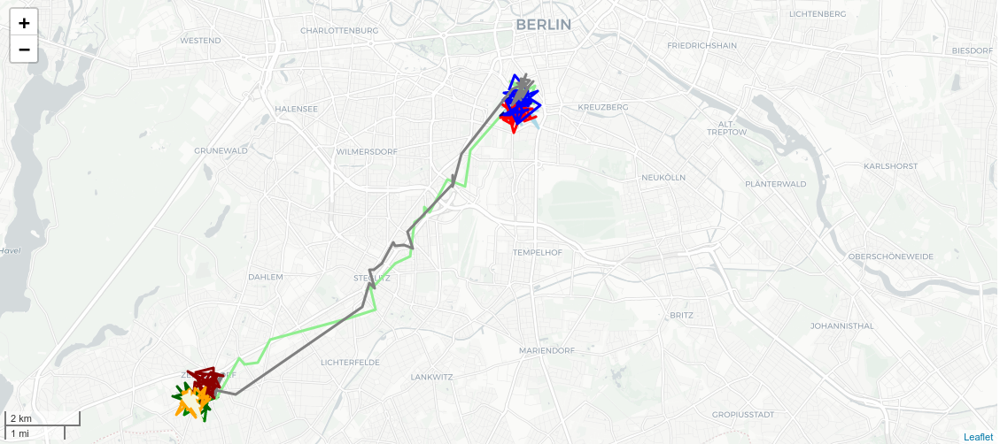
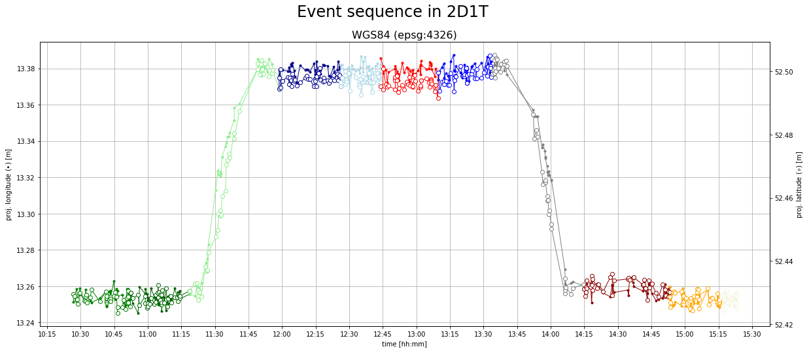
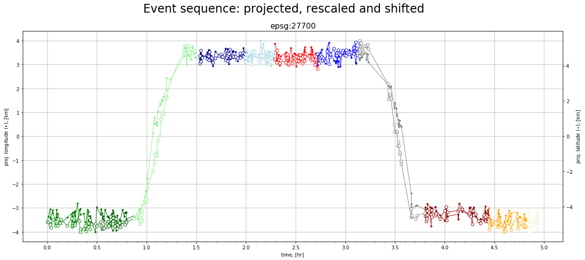
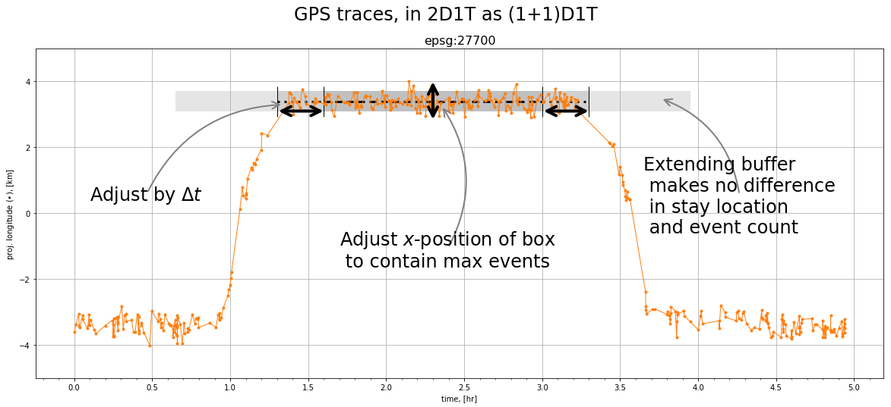

# Introduction: movement analysis

From a sequence of signaling events, _eg_ GPS measurements, determine locations where the device remains stationary for a significant duration of time; these are commonly called "stays". 
For each of these, there should be a beginning and end, as well as a location (and buffer) which describes an area where the device is likely stationary . 

**Note** the signaling events for a given device, form a set $\mathcal{E} :=  \{e_i = (\mathbf{x}_i, t_i), i=[0,N-1] \; | \; t_{i+1}\geq t_i\}$, where $\mathbf{x}_i$ represents a pair of longitude, latitude--coordinates at time $t_i$.

## A sequence of spatio-temporal events

Such a sequence of events may look like this:

  
**Figure 1** 
  
There are a few noticeable clusters of events which are likely stays; and they're connected by two paths, which are commonly called "travels".
Note the colors denote arbirary subsequences and are associated with the plots below where the time is shown explicitly.
(For an interactive HTML map, click [here](file:///home/sandm/Notebooks/stay_classification/docs/illustration/map.html).)

## 2D1T rendering

The map-view of the event sequences tells a lot but it also obscures a lot. It's helpful to view the sequences rather in a format where time is explicitly visible.
Enter the 2D1T plot: two spatial dimensions and time.

  
**Figure 2** 
  
Here in the 2D1T view, time is on the "$x$"-axis. Note that it's not really a 2D1T plot, but rather two 1D1T plots with the longitude on the left $y$-axis and the latitude on the right $y$-axis. The trace can be more clearly seen as (at least) three stays and two travels: initially around lon. $\approx$13.25, then a stay at lon. $\approx$ 13.375, and returning to the initial location. 

### Apply projections, and Shift & Scale transforms

A few further transforms are helpful: namely rescaled and shifted coordinates in a local coordinate frame.

  
**Figure 3** 
  
To make the classification easier, the coordinates are projected into a local coordinate frame where the distance metric and statistics are homogeneous and isotropic, and are easier to apply. For further convenience, the projected coordinates and time are rescaled and shifted.

The goal now, is to automatically identify the stays: where they begin and end, as well as an estimate of their locations.

# Stay classification

The quasi-2D1T plots show clearly that identifying a stay effectively means to fit subsequences of event with flat (constant lon.- and lat.-) lines.

For a subsequence of events $\mathcal{s}_l =  \{e_i \; | \; i = [m,n]_l \subset [0,N-1]\}$, a "flat line" has $|\mathbf{x}_m-\mathbf{x}_n| = 0 $. However, since there's noise, a more general spefication is needed.

## Stay specifications

Stays have some universal requirements.

Firstly, there are the primary requirements:
1. identify the start/stop
2. estimate a dominant location, _ie_ the "central location" of the stay

Then, there are some secondary rquirements:
1. the clusters should contain a minimum number of points
2. the duration between the first and last points should exceed $\Delta t$
3. the clusters should be as long (in time) as _contiguously_ possible
    * no sufficiently long breaks between consecutive events

One additional requirement which affects all of the above: outliers should be identified and ignored
* outliers can change the central location and also the beginning/ending of the clusters

## Strategy: the 'box' method

The algorithm is described below. 

### The "wordy" version
0. initialize the box
1. extend the box-ends forward and backwards in time by $\Delta t$, the minimum time for a stay
2. include new events within the new box
3. update box
4. repeat 1$-$3 until no changes are detected 

### The "mathy" version
0. Initialize box: given an event $e_i$
    * initialize the central location $x_{\mathrm{cent.}} = x_i$
        * box width is  $x_{\mathrm{cent.}} \pm \varepsilon$
    * initialize box-end timepoints as $t_m , t_n = t_i$ 
1. extend box-ends forward and backwards in time in increments of $\Delta t$
    * $\Delta t$, the minimum time for a stay
    * new box-ends: $t'_m = t_m - \Delta t$ and $t'_n = t_n + \Delta t$
2. include events falling within the new box
    * $t'$ of $e'(\mathbf{x}',t')$ s.t. $t'_m < t' \leq t_m$, etc. for $t_n, t'_n$
3. update box
    * update central location $x_{\mathrm{cent.}} = \mathrm{mean}(x'_m, \dots, x'_n)$
        * note, the mean should be a robust mean which deals with outliers
        * aim to fit as many events in as possible
    * update $t_m, t_n$ from the robustly included events
    * box is specified by a length of $t_n - t_m$ and a width of $x_{\mathrm{cent.}} \pm \varepsilon$
4. repeat 1$-$3 until no changes are detected
    * changes like more events or changes to the central location

  
**Figure 4** 
  
The box method illustrated on the middle stay. One box is centered around the stay, and captures most of the events. The box shows extensions which aim to capture more events; however, once all possible events are included and the central location stops changing, extending the box has no effect. Note that this is in 1D1T but it can also be applied to 2D1T, but the box becomes a cylinder of radius $\varepsilon$.

## Pros and cons

The box method works farily well, but as with many of these algorithms, there is a tendency to over-classify stays, since the noise generates various small clusters which satisfy the above criteria but are clearly not stays given their placement in the context of the entire sequence. 

The box method reliably catches the large stays but needs several passes through the chain in order to weed out the false-stays. 
A way to get through this is to first identify mini-clusters and merge those which are close enough to be merged. Once this is done, then the box method can be applied to the merged mini-clusters.
One of the niceties of this approach is that the mini-clustering and merging is linear in the number of events, and the box method only then works on the clusters 

## Notes
* There are similarities with hierarchical clustering methods
    * forming a cluster with a buffer of $\varepsilon$ around each event and finding which clusters intersect, and then describing new multi-event clusters by a central location
        * one problem is if the events are dense enough in time, then travels will be included as clusters
    * it is also a loose variant of DBSCAN, except the temporal sequence plays a role to distinquish clusters

### The optimization problem 

The criteria above suggest an optimization problem: for each stay, 
* maximize the length of the flat fit line, while 
    * mimimizing its error by adjusting its position ($\mathrm{x}_{\mathrm{opt.}}$) and end-regions ($t_{\mathrm{start}}, t_{\mathrm{stop}}$)
    * ignoring the outliers.

Then, the entire trace should also have an optimal solution, though with some local extrema.

* When the error is the mean squared error: $\epsilon := \sqrt{ \frac{1}{N}\sum^N_i(\mathrm{x}_i-\mathrm{x}_{\mathrm{opt.}})^2}$; 
    * this simplifies the position since the mean (or "centroid") is the value of $\mathrm{x}_{\mathrm{opt.}}$ which minimizes this error, leaving only the adjustment of the end-regions and outliers for the optimization task.

This suggests that there is at least a solution to this problem: 
One could consider all possible combinations of subsequences and all possible combinations of their outliers, and measure error, and then pick any from the set of lowest error subsequence-outlier combination fits. However, this is similar to the maximum subarray problem, and in the worst case it would be $\mathcal{O}(n^3)$.

It's countably finite, but impractical approach; itcan be a benchmark to compare all other algorithms which aim to do the same within some acceptable error.

--- 

# The project

## The goals

The goal of this project is multifold:
1. have a method which, albeit potentially slow, optimally decomposes an event sequence into a sequence of stays and travels
    * _optimally_ means that given the uncertainty and statistical measures involved to determine the stay, there are no better classifications possible
2. once above, method is established, find faster, more efficient approximations
3. have a reference one with which to explore, compare and evaluate other methods
    * _e.g._ regressors, DBSCAN, hierchical clustering, _etc._, methods from other reasearchers

## Contents

There are a few different modules included here:
* `synthetic_data`: a module which creates event sequences which are meant to simulate data coming from mobile device signaling events
    * sequences can be specified, with locations and endpoints of stays
    * sequences can be randomly specified
    * batches of sequences are also possible to test any new methods on many examples
    * canonical sequences, 
        * _ie_ minimal subsequences which exhibit the main challenges, 
        * useful for quick testing and fault identification
* `box_method`: a module which includes an implementation of the above described box method

